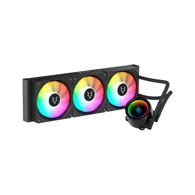

# CPU Cooler Display on Linux

`cpu_cooler` is a Rust application that reads the CPU temperature on Linux and writes it to the display of a USB water cooler.

The project was originally written in Python and has since been rewritten in Rust. The current version adds a proper configuration file, cleaner deployment options, and a better fit for long-running service usage.

Tested with Water Cooler Husky Glacier.




## Features

- Native Rust binary
- Configuration via TOML file
- Automatic config lookup in standard locations
- Reads CPU temperature from `/sys/class/hwmon`
- Can run as a user `systemd` service
- Graceful shutdown on `Ctrl+C` or service stop

## How it works

The application:

1. Loads a TOML configuration file
2. Opens the HID device using the configured vendor and product IDs
3. Searches `/sys/class/hwmon` for a temperature sensor whose `name` or `device/label` matches one of the configured keywords
4. Reads `temp1_input`, converts it to Celsius, and sends the rounded value to the cooler display
5. Repeats the update using the configured interval

## Requirements

- Linux
- A compatible USB cooler display
- Access to `/sys/class/hwmon`
- Access to the HID USB device
- Rust toolchain if you want to build from source

## Configuration

The application uses a TOML config file with the following fields:

```toml
vendor_id = "0xaa88"
product_id = "0x8666"
update_interval_secs = 1
cpu_sensor_keywords = ["k10temp", "cpu"]
```

Field details:

- `vendor_id`: USB vendor ID, accepts hexadecimal like `"0xaa88"` or decimal
- `product_id`: USB product ID, accepts hexadecimal like `"0x8666"` or decimal
- `update_interval_secs`: refresh interval in seconds
- `cpu_sensor_keywords`: list of case-insensitive keywords used to identify the correct CPU sensor

### Config file lookup order

The binary looks for configuration in this order:

1. Path set by `CPU_COOLER_CONFIG`
2. `$XDG_CONFIG_HOME/cpu_cooler/config.toml`
3. `~/.config/cpu_cooler/config.toml`
4. `/etc/cpu_cooler/config.toml`
5. `./cpu_cooler.toml`
6. `cpu_cooler.toml` next to the executable

The sample file in this repository is [`cpu_cooler.toml`](cpu_cooler.toml).

## Finding your device IDs

Use `lsusb` to identify the cooler USB device:

```bash
lsusb
```

Then update `vendor_id` and `product_id` in your config file.

## Choosing the CPU sensor

This project no longer depends on `psutil`. It reads temperatures directly from Linux hardware monitor entries in `/sys/class/hwmon`.

By default, the example configuration uses:

```toml
cpu_sensor_keywords = ["k10temp", "cpu"]
```

If your machine exposes the CPU sensor under a different name, inspect the available hwmon entries and adjust the keywords accordingly:

```bash
find /sys/class/hwmon -maxdepth 2 \( -name name -o -name label \) -print -exec cat {} \;
```

The first sensor whose `name` or `device/label` contains one of the configured keywords will be used.

## Build and run

Run directly from the repository:

```bash
cargo run
```

Or build a release binary:

```bash
cargo build --release
./target/release/cpu_cooler
```

If the config file is not in one of the default locations, point to it explicitly:

```bash
CPU_COOLER_CONFIG=/path/to/config.toml cargo run --release
```

## Logging

The application uses `env_logger`. The default log level is `info`.

Examples:

```bash
RUST_LOG=info cargo run
RUST_LOG=warn ./target/release/cpu_cooler
```

## Running without sudo

If your user cannot access the HID device directly, create a `udev` rule.

Create `/etc/udev/rules.d/99-cpu-cooler.rules` with:

```bash
SUBSYSTEMS=="usb", ATTRS{idVendor}=="VENDOR-ID", ATTRS{idProduct}=="PRODUCT-ID", MODE="0666"
```

Replace `VENDOR-ID` and `PRODUCT-ID` with the hexadecimal IDs from your device, without the `0x` prefix.

Reload the rules:

```bash
sudo udevadm control --reload-rules
sudo udevadm trigger
```

Then test again without `sudo`.

## Run as a user service

Install the binary:

```bash
mkdir -p ~/.local/bin
cargo build --release
cp target/release/cpu_cooler ~/.local/bin/
```

Install the config file in a standard location:

```bash
mkdir -p ~/.config/cpu_cooler
cp cpu_cooler.toml ~/.config/cpu_cooler/config.toml
```

Install and enable the service:

```bash
mkdir -p ~/.config/systemd/user
cp cpu-cooler.service ~/.config/systemd/user/
systemctl --user daemon-reload
systemctl --user enable --now cpu-cooler.service
```

The provided service file starts:

```bash
%h/.local/bin/cpu_cooler
```

Since the service does not pass `CPU_COOLER_CONFIG`, placing the config at `~/.config/cpu_cooler/config.toml` is the simplest option.

## Project structure

- [`src/main.rs`](src/main.rs): startup, logging, signal handling, update loop
- [`src/config.rs`](src/config.rs): config loading and path discovery
- [`src/temperature.rs`](src/temperature.rs): CPU sensor detection and temperature reading
- [`src/display.rs`](src/display.rs): HID write logic

## Notes

- The current implementation reads `temp1_input` from the first matching hwmon device
- If no matching sensor is found, the application logs a warning and retries on the next cycle
- If the HID device cannot be opened at startup, the application exits with an error

## Original Python project

This Rust version was based on the original Python implementation:

<https://github.com/martiniano/cpu-cooler>

## Acknowledgements

This project was also developed with AI assistance, including support from Codex.
